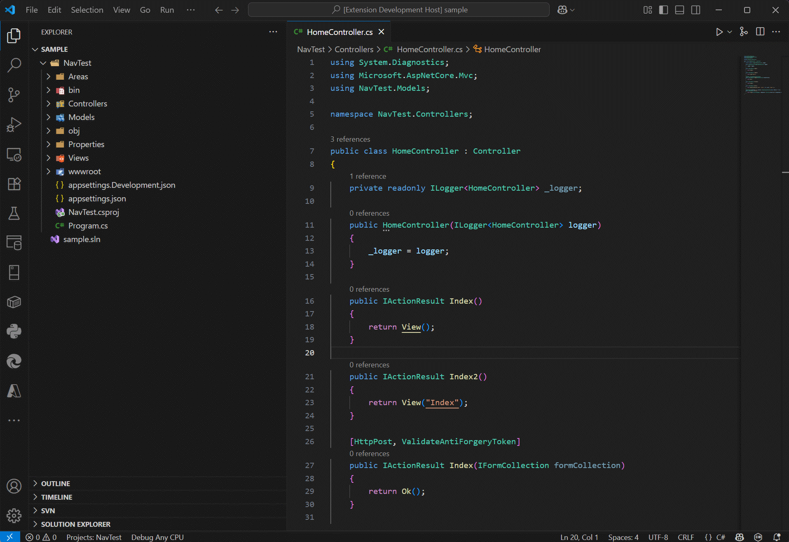

# ASP.NET MVC Navigator

A Visual Studio Code extension that recreates the intelligent navigation features found in JetBrains Rider and ReSharper for ASP.NET MVC projects.

## Demo

## Features

### 🎯 Controller Navigation
Ctrl+click to jump from controller code to views, actions, and view components.
- Example: `View("About")` → jumps to `About.cshtml`
- Example: `ViewComponent("NavigationMenu")` → jumps to `NavigationMenuViewComponent`

### 🌐 View Navigation
Ctrl+click from Razor views to controllers and actions.
- Example: `@Html.ActionLink("Edit", "Edit", "Product")` → jumps to `ProductController.Edit()`
- Example: `@Html.Partial("~/Views/Shared/_Navigation.cshtml")` → jumps to partial view

### 🏷️ Tag Helper & HTML Helper Support
Navigate with ASP.NET Core tag helpers and classic HTML helpers.
- Example: `<a asp-action="Details" asp-controller="Product">` → jumps to action
- Example: `<partial name="/Areas/Admin/Views/Shared/_Header.cshtml" />` → jumps to partial view

### 🏢 Advanced Features
- Full path support: tilde (`~/...`) and absolute (`/...`) paths for views and partials
- Areas & multi-project: seamless navigation across Areas and multi-project workspaces
- Fallback search: finds controllers and view components in shared or non-standard files
- Precise positioning: jumps directly to the exact line of class or method definitions

## Usage

Simply Ctrl+click (or Cmd+click on Mac) on any MVC controller, action, or view name string in your code. The extension will:
1. Analyze the code context
2. Locate the target file (controller, view, or action)
3. Navigate directly to the destination
4. Position the cursor at the exact method or view

## Compatibility

- ASP.NET MVC (.NET Framework)
- ASP.NET Core MVC (.NET Core/.NET 5+)
- Razor Pages projects
- Areas and multi-project solutions

## Configuration

| Setting | Default | Description |
|---------|---------|-------------|
| `mvcNavigator.enableDebugLogging` | `false` | Enable debug logging for troubleshooting navigation issues. Logs appear in the developer tools console. |